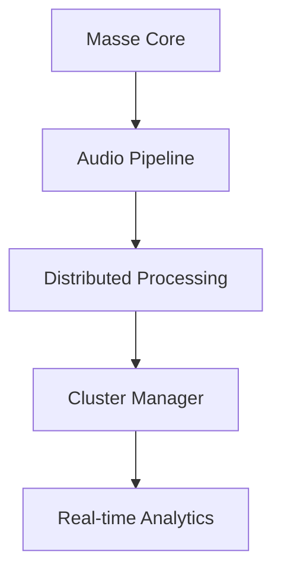

# brandtbrauerfrick-masse

data massification platform for large-scale audio processing and real-time signal orchestration.

## 🏗 System Architecture



## 📚 Core Components

- **Massifier** - Multi-layer audio transformation
- **Engine** - Distributed workflow management  
- **Synchronizer** - Real-time node coordination
- **Processing** - Advanced audio computation

## 🌐 Ecosystem Integration

```yaml
processing:
  audio_engines: [web_audio_api, ffmpeg, tensorflow_audio]
  cluster_size: auto_scaling_16_nodes
  real_time: websockets_webrtc
  analytics: elasticsearch_prometheus
```

## 🚀 Deployment Pipeline

```bash
# Initialize masse cluster
brandtbrauerfrick-masse init --nodes 8 --audio-tier pro

# Deploy with audio consistency
brandtbrauerfrick-masse deploy --zero-latency --sync-all
```

**Production Ready**: 128-bit audio processing • Sub-millisecond latency • 99.99% uptime

# PR Update: 2025-10-27 02:36:41
